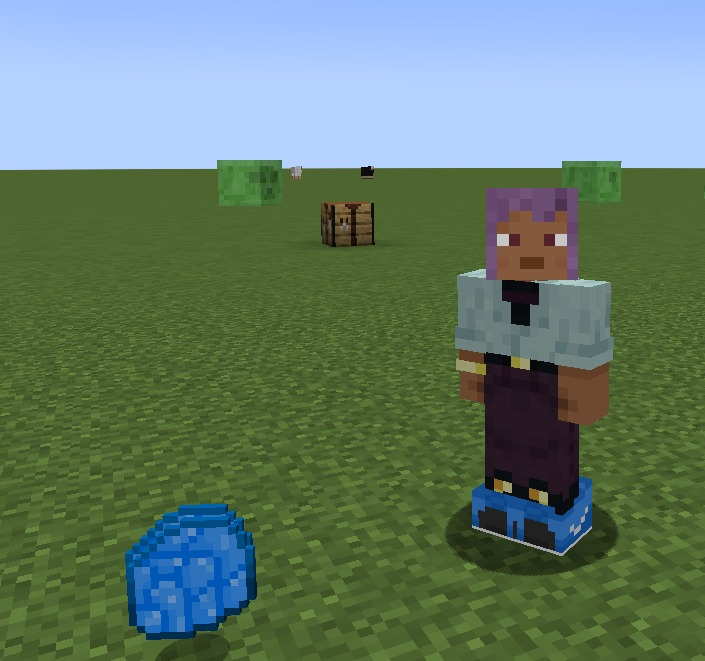
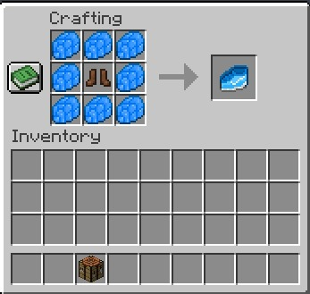

# **Mod Rotabombalino** 
La inspiración detrás de la realización del mod viene del trend actual de brainrot italiano, retratando seres absurdos generados con inteligencia artificial, acompañados de frases en italiano sin sentido.

Buscamos retratar lo absurdo de este meme en Minecraft para hacer de estos memes una experiencia interactiva.

# **Caracteristicas del mod y sus componentes:**

Nombre del Mod: Rotabombalino

Tipo: Aventura

Boss fight

## **Items Nuevos:**

• Nucleo del Altar

• Altar de invocaion

## **Cómo craftear el Nucleo del Altar**

Para craftear el **Nucleo del Altar**, necesitarás acceder al Nether y obtener algunos recursos clave. A continuación, te explicamos cómo conseguir cada uno de ellos:

1. **Fragmento de Prismarina**  
   Los **Fragmentos de Prismarina** se pueden obtener derrotando **Guardianes** en los **Monumentos Oceánicos**. Asegúrate de explorar los océanos profundos para encontrarlos.

2. **Vidrio**  
   El **Vidrio** es un material fácil de conseguir. Solo necesitarás **Arena**, la cual puedes encontrar en la playa o en el desierto. Luego, coloca la arena en el horno para fundirla y obtener vidrio.

3. **Estrella del Nether**  
   La **Estrella del Nether** se obtiene al derrotar al **Wither**. Para invocar al Wither, necesitarás 3 cabezas de Wither y 4 bloques de **Arena del Alma**, que se encuentran en el Nether. Una vez derrotado, el Wither dejará caer la **Estrella del Nether**.

Con estos tres materiales, ya podrás craftear el **Nucleo del Altar**.

En esta imagen te proporcionare de la manera correcta como se carftea este item

## **Crafteo del Altar de Invocación**

Para craftear el **Altar de Invocación**, combina los siguientes materiales en la mesa de trabajo:

- **Cubo de Esmeralda**  
   El **Cubo de Esmeralda** se obtiene **combinando 9 esmeraldas** en la mesa de trabajo para formar el cubo.

- **Arena de Almas**  
   La **Arena de Almas** se encuentra en el **Nether** y se encuentra comúnmente en las llanuras del Nether y las zonas cercanas a las fortalezas del Nether.

- **Lozas de Madera**  
   Las **Lozas de Madera** se obtienen colocando **madera en la mesa de trabajo** y luego crafteándola en lozas.

- **Lozas de Ladrillo de Piedra Negra Pulida**  
   Para obtener **Lozas de Ladrillo de Piedra Negra Pulida**, primero debes craftear **Ladrillos de Piedra Negra Pulida** con **Piedra Negra Pulida** en la mesa de trabajo. Luego, craftea los ladrillos en lozas.

- **Bloque de Ladrillo de Piedra Negra Pulida**  
   Los **Bloques de Ladrillo de Piedra Negra Pulida** se obtienen crafteando **4 Ladrillos de Piedra Negra Pulida** en un bloque de 2x2 en la mesa de trabajo.

- **Nucleo del Altar**  
   Ya explicado anteriormente en el **crafteo del Nucleo del Altar**.

Una vez que tengas todos estos materiales, colócalos en la mesa de trabajo para craftear el **Altar de Invocación**.

## **Cómo usar el Altar de Invocación**

Una vez hayas crafteado el **Altar de Invocación**, ya estarás listo para invocar al jefe **Tralalero tralala**.

Coloca el altar en el suelo y **haz clic derecho sobre él** para iniciar la invocación. Asegúrate de estar preparado, ya que el combate será desafiante.

## **Drops del boss** 

Se espera que sea una batalla interesante por lo que cuando lo derrotes de dropeara los items necesarios para craftear sus botas las cuales te proporcionaran velocidad IV , VIII de armadura lo cual es un item bastante poderoso para tu aventura 

## **Como craftear las botas**
necesitara vencer al boss para que te dropee sus items:

- **Escamas de tralalero tralala**

- **Botas de cuero**

Despues de conseguir todo lo necesario podras craftearlo aqui te dejo como es la forma correcta de hacerlo

Y por ultimo en esta imagen veras las botas en el personaje listo para la aventura

